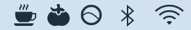
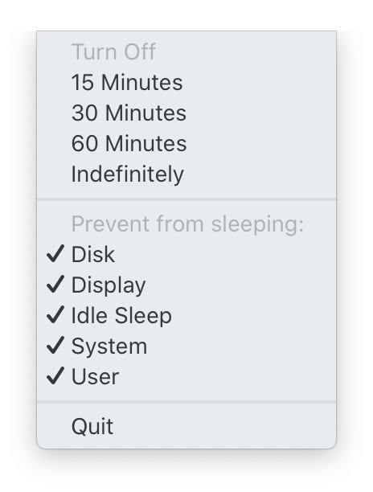
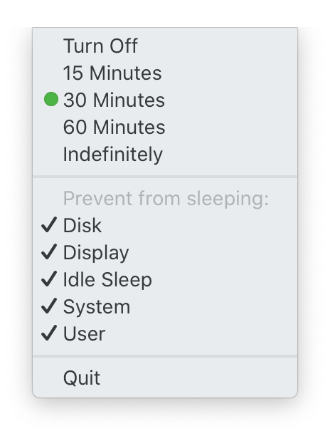

<h1>

Caffeinate
</h1>

Have you ever thought, while drinking a cup of coffee, "maybe my Mac wants
caffeine too?". It gets sleepy sometimes and dims its display, or falls
asleep altogether! With this menulet, you can share the caffeine goodness
and keep your Mac awake. Potentially most useful when giving presentations,
connected to remote servers, or ensuring a long task will complete uninterrupted.

## Usage

Once installed and running, the coffee cup icon will appear in the top left side 
of your menubar:

    

Clicking on it shows the following items. The first section lists time intervals
which you'd like to keep the system from sleeping. While the second allows you
to toggle options that alter the specific behavior which you want to prevent 
(see the Options section below for details).

    
    

## Installation

Options:

1. Download the app from GitHub releases,
   [here (zip)](https://github.com/zkokaja/caffeinate/releases/latest/download/Caffeinate.zip).
2. Build with XCode then go to Product -> Archive to get a `.app` file.

## Options

From ` man caffeinate`:

| Option     | Description |
| ---------- | ----------- |
| Disk       | Create an assertion to prevent the disk from idle sleeping.   |
| Display    | Create an assertion to prevent the display from sleeping.     |
| Idle Sleep | Create an assertion to prevent the system from idle sleeping. |
| System     | Create an assertion to prevent the system from sleeping. This assertion is valid only when system is running on AC power. |
| User       | Create an assertion to declare that user is active. If the display is off, this option turns the display on and prevents the display from going into idle sleep. | 

## Developer

The code is very simply and self explanatory, and I welcome contributions. We simply 
fork a process to `/usr/bin/caffeinate` for the core functionality.

## Attribution

Icons made by [Freepik](https://www.flaticon.com/authors/freepik) from 
[www.flaticon.com](https://www.flaticon.com).
